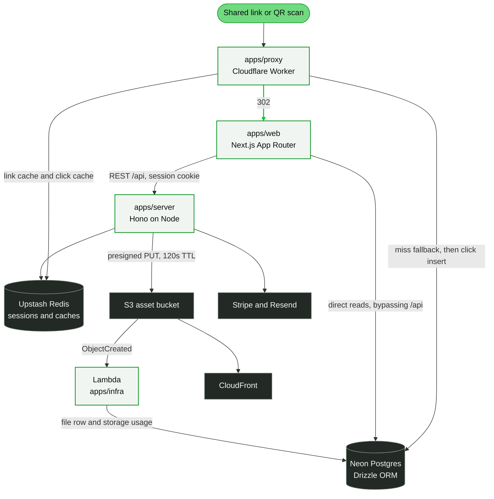

# leaperone

<p align="center">
  
</p>

A digital business card platform. Each card gets a stable `identifier` that resolves through a dedicated edge service to a server-rendered public page, so the card stays shareable, editable, and measurable after it has already been handed over.

The repository is a Bun and Turborepo monorepo containing a Next.js application, a Hono API server, a Cloudflare Worker that resolves short links and records click analytics, and an AWS CDK app that provisions the asset storage pipeline.

## What a card looks like

One card record, three presentation templates. The template belongs to the card's design document and is resolved through a lazy-loaded dynamic import, so a card page loads only the template it renders.

<p align="center">
  
</p>

---

## Why this exists

A paper business card is a dead end. Once it is handed over it cannot be updated, and the exchange produces no data. A link-in-bio page solves the sharing problem but not the surrounding workflow: no lead capture, no view or click history, no way for a company to issue cards to a whole team, and no way to know which card actually drove a conversation.

leaperone treats the card as a durable, addressable object. The `identifier` is the unit of sharing, and everything else is built on top of it: per-click attribution, team workspaces with role-based permissions, storage per workspace, and subscription-based plan limits.

---

## How it works



**Request paths.** Authenticated product operations go from the web app to the Hono API under `/api`, with an opaque session cookie. Two paths deliberately bypass the API: the public card page reads Postgres directly through the Neon HTTP driver, and the Next.js middleware in `apps/web/proxy.ts` reads subscription state directly so an unsubscribed user is redirected before a dashboard route renders.

**Short links.** A shared identifier is resolved by the Worker in `apps/proxy`, not by the API server. The Worker checks a Redis link cache (24-hour TTL) and falls back to Postgres on a miss, repopulating the cache through `executionCtx.waitUntil` so the redirect is not delayed. It then issues a `302` to `/card/[id]`. Click attribution runs inside the same `waitUntil`, after the response is already on its way back to the browser.

**Uploads.** The API signs a 120-second presigned `PUT` URL, scoped to a key under `asset-manager/`. The client uploads to S3 with that URL, and an S3 `ObjectCreated` notification on that prefix invokes a Lambda that writes the `file` row and increments `storage.usage` in a single transaction.

---

## Engineering notes

**Sessions are opaque Redis tokens, not JWTs.** A session token is a CUID2 value stored in Upstash Redis as a `FullSession` record with a 7-day TTL, extended automatically once a session is within a day of expiry. That makes "log this user out everywhere" a cheap operation, which the password reset and account restriction endpoints rely on. Permissions are resolved from the database on every authenticated request rather than being embedded in a token, so a permission change takes effect immediately instead of at the next refresh.

**Not every read goes through the API.** The public card page and the dashboard middleware both need data before a route renders. Rather than exposing public endpoints for those two paths, they read Postgres directly with the Neon serverless driver and share a Drizzle query cache backed by Upstash. The cost is duplicated data access; the benefit is lower latency on the paths where it matters most, public card loads and the subscription gate.

**Authorization is composable.** Cross-cutting checks are Hono middleware (`isAuth`, `hasWorkspace`, `hasActiveSubscription`, `hasTeamPlan`, `hasTeamPlanWithSeats`, `checkStorageQuota`, `canManageBusinessCard`) attached per route, and route ordering is meaningful because `hasWorkspace` is what loads the workspace and subscription into the request context. Finer-grained checks happen inside services through the `hasPermissions` repository function, so the same role tables govern both route gating and in-handler decisions.

**Uploads are signed, not proxied.** Serving uploads through the API would put a file-sized workload on the request path, so the API only produces a signature. Creating the database row from the actual S3 event rather than from a client claim means the record reflects what really landed in the bucket. The Lambda skips any object that does not carry the expected `storage-id` metadata, so stray objects are ignored rather than materialized as rows.

**Click deduplication combines two signals.** A cookie scoped to the specific card identifier handles the common repeat-visit case, and a SHA-256 fingerprint of IP plus user agent catches clients that do not retain cookies. Both are remembered in Redis for an hour, which is what stops a single device from inflating analytics by refreshing the page. `HEAD` requests are redirected without being tracked, since link previews would otherwise register as clicks.

**Configuration fails at boot.** Every process reads its environment through a Zod schema in `@app/env`, and a missing or malformed variable stops the process immediately instead of surfacing as a runtime failure on one specific request. Shared request and form schemas live in `@app/zod`, so the web app and the API validate the same shapes.

**Client state is split by concern.** The card editor uses four small Zustand stores (content, design, QR code, step index) composed through a shallow selector hook, so an edit in one step does not invalidate subscribers of the others. The asset manager uses a different pattern: a `useReducer` for local UI state merged with an infinite query for server state, exposed through a context that keeps the two in sync.

**Templates are loaded on demand.** The template registry maps each template name to a dynamic import, so a card page loads only the template it renders, and each editor panel is loaded when its step becomes active. The QR preview library runs in the browser, where it needs the DOM.

---

## Technology stack

| Layer | Choice | Role |
| --- | --- | --- |
| Monorepo | Bun workspaces, Turborepo | Dependency management, task graph, caching |
| Frontend | Next.js 16 App Router, React 19, Turbopack | Server-rendered product UI and public card pages |
| Compiler | React Compiler | Automatic memoization, enabled in `next.config.ts` |
| Server state | TanStack Query, axios | Query and mutation caching, request layer |
| Client state | Zustand, `useReducer` | Editor stores and composite UI state |
| Forms | TanStack Form, React Hook Form, Zod | Auth and invitation forms, marketing forms, shared validation |
| Styling | Tailwind CSS v4, shadcn/ui on Radix | Component system in `@app/ui` |
| Charts | Recharts, react19-simple-maps | Analytics charts and the world map |
| API | Hono on `@hono/node-server` | Typed routing with a per-route middleware pipeline |
| Server build | tsdown | ESM bundling |
| Database | Postgres on Neon, Drizzle ORM | Schema, migrations, repositories, query cache |
| Cache and sessions | Upstash Redis | Session store, link cache, click cache, query cache |
| Edge | Cloudflare Workers, Wrangler | Link resolution and click attribution |
| Storage | AWS S3, CloudFront, Lambda | Upload target, CDN, event-driven ingestion |
| Infrastructure | AWS CDK | Bucket, distribution, Lambda, log group |
| Billing | Stripe | Checkout, seats, billing portal, webhooks |
| Email | Resend | Verification, password reset, and invitation mail |
| Logging | Pino | Structured logs, pretty-printed in development |
| Tooling | Biome | Linting and formatting across the workspace |
| Git hooks | Husky, lint-staged, commitlint | Pre-commit formatting, conventional commits |

---

## Repository structure

```
.
├── apps/
│   ├── web/               Next.js app: marketing, card builder, auth, dashboard, public cards
│   ├── server/            Hono API: auth, business cards, analytics reads, assets, teams, billing
│   ├── proxy/             Cloudflare Worker: short links, click deduplication, analytics writes
│   └── infra/             AWS CDK: S3 bucket, CloudFront distribution, Lambda, log group
├── packages/
│   ├── database/          Drizzle schema (18 tables), migrations, repositories, RBAC seed
│   ├── ui/                shadcn/ui component library on Radix primitives
│   ├── session/           Redis-backed session service with sliding expiry and revocation
│   ├── core/              Shared constants (limits, TTLs, cookie names) and cookie options
│   ├── env/               Zod-validated environment schemas
│   ├── error/             ApiError, HTTP status map, error code enum
│   ├── logger/            Pino singleton
│   ├── types/             Shared domain types for cards, sessions, analytics, subscriptions
│   ├── zod/               Request and form schemas shared by the web app and the API
│   ├── biome-config/      Shared Biome configuration
│   └── tsconfig/          Shared TypeScript configurations
├── docker/server/         Multi-stage Dockerfile for the API server (Turbo prune, non-root runtime)
├── docker-compose.yaml    Local Redis and a serverless-redis-http gateway
└── turbo.jsonc            Task graph
```

---

## Getting started

### Prerequisites

- **Bun 1.4.2**, pinned in the root `packageManager` field
- **Node.js 22.22 or later**
- **Docker**, for the local Redis stack
- Credentials for **Neon Postgres**, **Upstash Redis**, **Stripe**, **Resend**, and **AWS S3**

The API validates its environment at boot and refuses to start if a required variable is missing, so have the credentials available before running it.

### Installation

```bash
# Install all workspace dependencies
bun install

# Local Redis on :6379 plus a serverless-redis-http gateway on :8079,
# which exposes an Upstash-compatible REST API for local development
docker compose up -d
```

Then create local environment files. Each app ships an example:

```bash
cp apps/server/.env.example      apps/server/.env.development
cp apps/web/.env.example         apps/web/.env.development
cp apps/infra/.env.example       apps/infra/.env.development
cp packages/database/.env.example packages/database/.env.development

# The Worker reads Wrangler variables instead of .env files
cp apps/proxy/.env.example       apps/proxy/.dev.vars.development
```

Point `UPSTASH_REDIS_REST_URL` at `http://localhost:8079` and `UPSTASH_REDIS_REST_TOKEN` at `example_token` to use the Docker gateway. Every other value has to come from the real provider.

Note that `apps/web/.env.example` still lists `STRIPE_ANNUAL_PRICE_ID` and `STRIPE_MONTHLY_PRICE_ID`, while the client schema expects their `NEXT_PUBLIC_` counterparts. Use the `NEXT_PUBLIC_` names in `apps/web/.env.development`.

### Database setup

Migrations live in `packages/database/drizzle`. Apply them, then seed the RBAC tables, before starting the API:

```bash
cd packages/database
bun run db:migrate
bun run db:seed     # roles, permissions, and role_permissions
```

The seed script rewrites only the RBAC tables: it clears `roles`, `permissions`, and `role_permissions` and reinserts the defaults. Cards, users, and workspaces are never touched.

### Running the project

```bash
bun run dev            # all dev servers through Turbo
```

Or start only what you need:

```bash
cd apps/web    && bun run dev    # Next.js on http://localhost:3000
cd apps/server && bun run dev    # Hono on http://localhost:8080/api
cd apps/proxy  && bun run dev    # Wrangler, default port 8787
```

`apps/infra` is a CDK app and has no `dev` script, so `bun run dev` skips it.

The API is mounted under `/api`. With no session cookie present, an authenticated route such as `GET /api/auth/get-session` returns `401` with the standard error envelope, which is a quick way to confirm the server and its middleware chain are up:

```bash
curl -i http://localhost:8080/api/auth/get-session
```

---

## Usage

### Building and publishing a card

1. Open `/` and work through the three editor steps: add content, customize design and settings, then design the QR code.
2. Sign up at `/sign-up` and verify the email address.
3. Subscribe from `/pricing`. Dashboard routes require an active subscription, so this step comes before the dashboard becomes reachable.
4. Activate the card with the status toggle in the dashboard. An active card is reachable at `/card/[id]` and through its shareable identifier.

### Public routes

These routes are reachable without a session:

| Route | Purpose |
| --- | --- |
| `/` | Marketing page and the card builder |
| `/pricing` | Plans and Stripe checkout entry |
| `/faq-support`, `/contact-us` | Support and contact forms |
| `/privacy-policy`, `/terms-and-condition` | Legal pages |
| `/login`, `/sign-up`, `/forgot-password`, `/reset-password/[token]` | Authentication |
| `/invite`, `/password-setup/[token]` | Invitation acceptance and password setup |
| `/card/[id]` | A published card, rendered from the database |
| `/expired`, `/cancelled` | Subscription state notices |

Everything under `/dashboard` requires a session and an active subscription. The middleware in `apps/web/proxy.ts` enforces both: no session redirects to `/login`, no subscription redirects to `/pricing`, an inactive subscription redirects to `/expired`, and a subscription set to cancel at period end redirects to `/cancelled`.

### Working on short links and analytics locally

Link resolution and click recording only run in the Worker, so `bun run dev` inside the app directories does not exercise that path. Run the Worker and request a known identifier:

```bash
cd apps/proxy
bun run dev            # wrangler dev, reading .dev.vars.development
```

```bash
# Follow the redirect and then verify the recorded row in the analytics table
curl -i http://localhost:8787/<identifier>
```

---

## Features

**Card building and publishing**

- Three-step editor: add content, customize design and settings, then design the QR code.
- Three render templates (`classic`, `modern`, `premium`) resolved through a lazy-loaded dynamic import registry.
- Card content, design, and QR configuration are stored as separate `jsonb` documents, so a published card can be edited without changing its identifier or its shareable URL.
- Public cards are served at `/card/[id]`, rendered on the server and cached at the query level.

**Sharing**

- Short links resolve through a Cloudflare Worker instead of the application server.
- QR codes are generated in the browser with `qr-code-styling`, with customizable body shapes, corner styles, gradients, and SVG or PNG download.
- Share targets for LinkedIn, X, Facebook, WhatsApp, and email, plus an embeddable iframe snippet.
- NFC kit catalogue and an activation flow in the dashboard.

**Analytics**

- Per-click records including device, vendor, model, browser, engine, operating system, CPU architecture, and geolocation down to city and coordinates.
- Dashboard views for scan trends by date and platform, day-of-week and time-of-day breakdowns, device and browser distribution, and top countries, regions, and cities. The charts are Recharts; the location view is a world map rendered with `react19-simple-maps`.
- Bot and crawler traffic is detected and served a static page so it never pollutes metrics.
- IP addresses are not persisted for visitors originating in EU countries.

**Teams and permissions**

- Invitation flow with an emailed token and a password setup step.
- Role-based access control backed by `roles`, `permissions`, and `role_permissions` tables. The two seeded roles are `owner` (all permissions) and `member` (`manage:nfc`); permission strings follow a `resource:action` shape (`invite:members`, `manage:subscription`, `view:member-analytics`, and others).
- Workspace owners can impersonate a member for support, using a separate one-hour manager session.
- Seat-based team plans, enforced at the API layer before team operations run.

**File and asset manager**

- Direct-to-S3 uploads with presigned `PUT` URLs. File bytes never pass through the API.
- Uploaded objects are reconciled into the database by a Lambda invoked on S3 object creation, inside a single transaction.
- CloudFront in front of the bucket for asset delivery.
- Per-workspace storage accounting with a quota check before an upload URL is signed.

**Billing**

- Stripe subscriptions with a 7-day trial, monthly and annual prices, and adjustable seat quantity.
- Plan type is derived from seat count rather than stored separately.
- Webhook handling for `checkout.session.completed`, `customer.subscription.updated`, and `customer.subscription.deleted`.

---

## Engineering notes

**Sessions are opaque Redis tokens, not JWTs.** A session token is a CUID2 value stored in Upstash Redis as a `FullSession` record with a 7-day TTL, extended automatically once a session is within a day of expiry. That makes "log this user out everywhere" a cheap operation, which the password reset and account restriction endpoints rely on. Permissions are resolved from the database on every authenticated request rather than being embedded in a token, so a permission change takes effect immediately instead of at the next refresh.

**Not every read goes through the API.** The public card page and the dashboard middleware both need data before a route renders. Rather than exposing public endpoints for those two paths, they read Postgres directly with the Neon serverless driver and share a Drizzle query cache backed by Upstash. The cost is duplicated data access; the benefit is lower latency on the paths where it matters most, public card loads and the subscription gate.

**Authorization is composable.** Cross-cutting checks are Hono middleware (`isAuth`, `hasWorkspace`, `hasActiveSubscription`, `hasTeamPlan`, `hasTeamPlanWithSeats`, `checkStorageQuota`, `canManageBusinessCard`) attached per route, and route ordering is meaningful because `hasWorkspace` is what loads the workspace and subscription into the request context. Finer-grained checks happen inside services through the `hasPermissions` repository function, so the same role tables govern both route gating and in-handler decisions.

**Uploads are signed, not proxied.** Serving uploads through the API would put a file-sized workload on the request path, so the API only produces a signature. Creating the database row from the actual S3 event rather than from a client claim means the record reflects what really landed in the bucket. The Lambda skips any object that does not carry the expected `storage-id` metadata, so stray objects are ignored rather than materialized as rows.

**Click deduplication combines two signals.** A cookie scoped to the specific card identifier handles the common repeat-visit case, and a SHA-256 fingerprint of IP plus user agent catches clients that do not retain cookies. Both are remembered in Redis for an hour, which is what stops a single device from inflating analytics by refreshing the page. `HEAD` requests are redirected without being tracked, since link previews would otherwise register as clicks.

**Configuration fails at boot.** Every process reads its environment through a Zod schema in `@app/env`, and a missing or malformed variable stops the process immediately instead of surfacing as a runtime failure on one specific request. Shared request and form schemas live in `@app/zod`, so the web app and the API validate the same shapes.

**Client state is split by concern.** The card editor uses four small Zustand stores (content, design, QR code, step index) composed through a shallow selector hook, so an edit in one step does not invalidate subscribers of the others. The asset manager uses a different pattern: a `useReducer` for local UI state merged with an infinite query for server state, exposed through a context that keeps the two in sync.

**Templates are loaded on demand.** The template registry maps each template name to a dynamic import, so a card page loads only the template it renders, and each editor panel is loaded when its step becomes active. The QR preview library runs in the browser, where it needs the DOM.

---

## Technology stack

| Layer | Choice | Role |
| --- | --- | --- |
| Monorepo | Bun workspaces, Turborepo | Dependency management, task graph, caching |
| Frontend | Next.js 16 App Router, React 19, Turbopack | Server-rendered product UI and public card pages |
| Compiler | React Compiler | Automatic memoization, enabled in `next.config.ts` |
| Server state | TanStack Query, axios | Query and mutation caching, request layer |
| Client state | Zustand, `useReducer` | Editor stores and composite UI state |
| Forms | TanStack Form, React Hook Form, Zod | Auth and invitation forms, marketing forms, shared validation |
| Styling | Tailwind CSS v4, shadcn/ui on Radix | Component system in `@app/ui` |
| Charts | Recharts, react19-simple-maps | Analytics charts and the world map |
| API | Hono on `@hono/node-server` | Typed routing with a per-route middleware pipeline |
| Server build | tsdown | ESM bundling |
| Database | Postgres on Neon, Drizzle ORM | Schema, migrations, repositories, query cache |
| Cache and sessions | Upstash Redis | Session store, link cache, click cache, query cache |
| Edge | Cloudflare Workers, Wrangler | Link resolution and click attribution |
| Storage | AWS S3, CloudFront, Lambda | Upload target, CDN, event-driven ingestion |
| Infrastructure | AWS CDK | Bucket, distribution, Lambda, log group |
| Billing | Stripe | Checkout, seats, billing portal, webhooks |
| Email | Resend | Verification, password reset, and invitation mail |
| Logging | Pino | Structured logs, pretty-printed in development |
| Tooling | Biome | Linting and formatting across the workspace |
| Git hooks | Husky, lint-staged, commitlint | Pre-commit formatting, conventional commits |

---

## Repository structure

```
.
├── apps/
│   ├── web/               Next.js app: marketing, card builder, auth, dashboard, public cards
│   ├── server/            Hono API: auth, business cards, analytics reads, assets, teams, billing
│   ├── proxy/             Cloudflare Worker: short links, click deduplication, analytics writes
│   └── infra/             AWS CDK: S3 bucket, CloudFront distribution, Lambda, log group
├── packages/
│   ├── database/          Drizzle schema (18 tables), migrations, repositories, RBAC seed
│   ├── ui/                shadcn/ui component library on Radix primitives
│   ├── session/           Redis-backed session service with sliding expiry and revocation
│   ├── core/              Shared constants (limits, TTLs, cookie names) and cookie options
│   ├── env/               Zod-validated environment schemas
│   ├── error/             ApiError, HTTP status map, error code enum
│   ├── logger/            Pino singleton
│   ├── types/             Shared domain types for cards, sessions, analytics, subscriptions
│   ├── zod/               Request and form schemas shared by the web app and the API
│   ├── biome-config/      Shared Biome configuration
│   └── tsconfig/          Shared TypeScript configurations
├── docker/server/         Multi-stage Dockerfile for the API server (Turbo prune, non-root runtime)
├── docker-compose.yaml    Local Redis and a serverless-redis-http gateway
└── turbo.jsonc            Task graph
```

---

## Configuration

Most configuration is declared in `packages/env` and validated with Zod at process start, so a missing or malformed variable fails the boot rather than a later request. Variables marked as required have no default. The Worker declares its bindings in its own types file instead, since Wrangler supplies them.

### API server (`apps/server`, schema `@app/env/server`)

| Variable | Default | Purpose |
| --- | --- | --- |
| `NODE_ENV` | `development` | Runtime mode, also controls log formatting |
| `LOG_LEVEL` | `info` | Pino log level |
| `PORT` | `8080` | HTTP listen port |
| `DATABASE_URL` | required | Neon Postgres connection string |
| `FRONTEND_URL` | `http://localhost:3000` | Allowed CORS and CSRF origin |
| `SERVER_URL` | `http://localhost:8080` | Server base URL |
| `AUTH_SECRET` | required | Secret for email verification tokens |
| `RESEND_API_KEY`, `RESEND_MAIL` | required | Resend credentials and sender address |
| `AWS_ACCESS_KEY_ID`, `AWS_SECRET_ACCESS_KEY`, `AWS_REGION` | required | S3 credentials and region |
| `S3_UPLOAD_BUCKET` | required | Bucket that receives uploads |
| `UPSTASH_REDIS_REST_URL`, `UPSTASH_REDIS_REST_TOKEN` | required | Redis for sessions and caches |
| `STRIPE_SECRET_KEY`, `STRIPE_WEBHOOK` | required | Stripe API key and webhook signing secret |
| `STRIPE_ANNUAL_PRICE_ID`, `STRIPE_MONTHLY_PRICE_ID` | required | Price IDs used at checkout |

### Web app (`apps/web`)

Client variables are validated in `@app/env/web/client` and must be prefixed with `NEXT_PUBLIC_`. Server-side usage in the middleware and server components is validated separately in `@app/env/web/server`.

| Variable | Default | Purpose |
| --- | --- | --- |
| `NEXT_PUBLIC_APP_URL` | `http://localhost:3000` | Canonical app URL, used to build card page links |
| `NEXT_PUBLIC_SERVER_URL` | `http://localhost:8080` | API base URL, with `/api` appended by the axios client |
| `NEXT_PUBLIC_ASSET_CDN` | CloudFront hostname | CDN origin for uploaded assets, ships with a placeholder default |
| `NEXT_PUBLIC_STRIPE_ANNUAL_PRICE_ID`, `NEXT_PUBLIC_STRIPE_MONTHLY_PRICE_ID` | required | Price IDs rendered on the pricing page |
| `NEXT_PUBLIC_PROXY_URL` | `http://localhost:8787` | Read directly from `process.env` when building share links |
| `DATABASE_URL` | required | Read by the public card page and the middleware |
| `UPSTASH_REDIS_REST_URL`, `UPSTASH_REDIS_REST_TOKEN` | required | Session reads in the middleware and server components |

### Worker (`apps/proxy`)

Bindings declared in `apps/proxy/src/types/global.types.ts` and provided through Wrangler variables: `DATABASE_URL`, `FRONTEND_URL`, `UPSTASH_REDIS_REST_URL`, `UPSTASH_REDIS_REST_TOKEN`.

### Infrastructure (`apps/infra`)

`NODE_ENV` (drives stack naming), `ORIGIN_URL` (S3 CORS origin), `DATABASE_URL` (used by the Lambda), `CDK_REGION`, and `CDK_ACCOUNT_ID`.

### Platform limits

Defined in `@app/core/constants`: 2 GB of storage per workspace, checked before an upload URL is signed; 5 KB to 2 MB per file and image MIME types only, validated in the shared Zod schema; a 50-file cap applied in the upload UI; and a 120-second presigned URL expiry.

---

## Development

### Workspace commands

```bash
bun run build      # turbo build across the workspace
bun run dev        # turbo dev
bun run lint       # biome lint --write
bun run format     # biome check --write
bun run clean      # remove .turbo and build output
```

Apps and packages expose `lint`, `format`, and `typecheck` scripts where they apply: `apps/web` and `apps/server` add `build`, `dev`, and `start`, `@app/database` declares the `db:*` tasks instead, and the two config-only packages declare no scripts. Turborepo wires these together through `turbo.jsonc`.

### Database changes

```bash
cd packages/database
bun run db:generate    # generate a migration from schema changes
bun run db:migrate     # apply pending migrations
bun run db:studio      # inspect data
```

### Tests

Automated tests currently exist only for the infrastructure app, where they assert the synthesized CloudFormation template:

```bash
cd apps/infra
bun test
```

### Conventions

- Biome handles both linting and formatting across the workspace, configured through `@app/biome-config`: 2-space indentation, 100-character lines, double quotes, and trailing commas. `lint-staged` runs `biome check --write` on staged files.
- Commit messages follow Conventional Commits, enforced by commitlint through a Husky `commit-msg` hook, with a 100-character header limit and a fixed type list.
- `AGENTS.md` documents the layout, import aliases (`@app/*` for workspace packages, `@/` for app-local paths), naming conventions, and the feature-folder structure used by both apps.

---

## Project status and known gaps

The product surfaces are implemented end to end, from the card editor through to analytics, teams, assets, and billing. A few areas are still rough, and they are listed here rather than left for a reader to discover:

- **Continuous integration is not active.** The workflow file lives at `.github/ci.yaml` instead of `.github/workflows/`, so GitHub does not schedule it. It also builds and deploys through a task definition at `.aws/task-definition.json`, which is not in the repository. No automated lint, typecheck, or test run currently gates a change.
- **Test coverage is thin.** Only `apps/infra` has a test suite. The API, the Worker, and the web app have none.
- **Some dashboard pages are placeholders.** `/dashboard/subscription` and `/dashboard/form-responses` render stub content, and the navigation groups `Settings` and `NFC Hardware` link to parent paths that have no page of their own.
- **NFC is a commerce and activation flow.** Kits can be browsed and activated, and `manage:nfc` exists as a permission, but there is no Web NFC integration or NFC-specific data model.
- **The Worker's not-found redirect is hardcoded** to `https://dev.leaperone.com/not-found` rather than being derived from its environment.
- **The analytics `trigger` column is never written.** The Worker computes the source (link or QR) but the insert statement does not include the column.
- **Session cookie options hardcode `domain: "localhost"`** in `@app/core`, which needs to be environment-driven before the app is served from a real domain.
- **No rate limiting.** `ApiError.tooManyRequests` exists but is not used by any middleware, and Redis is used for sessions and caches only.

